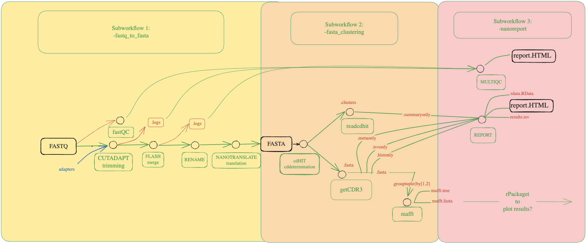

<h1>
  <picture>
    <source media="(prefers-color-scheme: dark)" srcset="docs/images/nf-core-nanorepertoire_logo_dark.png">
    
  </picture>
</h1>

[](https://github.com/codespaces/new/nf-core/nanorepertoire)
[](https://github.com/nf-core/nanorepertoire/actions/workflows/nf-test.yml)
[](https://github.com/nf-core/nanorepertoire/actions/workflows/linting.yml)[](https://nf-co.re/nanorepertoire/results)[](https://doi.org/10.5281/zenodo.XXXXXXX)
[](https://www.nf-test.com)

[](https://www.nextflow.io/)
[](https://github.com/nf-core/tools/releases/tag/3.4.1)
[](https://docs.conda.io/en/latest/)
[](https://www.docker.com/)
[](https://sylabs.io/docs/)
[](https://cloud.seqera.io/launch?pipeline=https://github.com/nf-core/nanorepertoire)

[](https://nfcore.slack.com/channels/nanorepertoire)[](https://bsky.app/profile/nf-co.re)[](https://mstdn.science/@nf_core)[](https://www.youtube.com/c/nf-core)

## Introduction


**lescailab/nanorepertoire** is a Nextflow-based bioinformatics pipeline designed to characterise *nanobody repertoires* from raw sequencing data (FASTQ files).
It performs quality control, read preprocessing, translation, clustering, and CDR3 extraction, producing comprehensive reports that describe nanobody diversity and repertoire composition.

The workflow is divided into three main subworkflows:

### 1. `fastq_to_fasta`
Processes raw sequencing data to produce translated FASTA sequences:
- **FastQC** – quality control of raw reads
- **Cutadapt** – adapter trimming
- **FLASH** – paired-end read merging
- **Rename** – standardized renaming of merged reads
- **Nanotranslate** – translation from nucleotide to amino acid sequences

### 2. `fasta_clustering`
Clusters and analyses translated nanobody sequences:
- **CD-HIT** – clustering of identical or highly similar sequences
- **ReadCDHIT** – extraction and summarization of cluster statistics
- **getCDR3** – extraction of CDR3 regions from translated nanobodies
- **MAFFT** – multiple sequence alignment of CDR3 clusters

### 3. `nanoreport`
Generates integrated reports and visual outputs:
- **MultiQC** – aggregation of QC metrics
- **Report (R-based)** – production of summary tables (`.tsv`), serialized objects (`.RData`), and an HTML report summarizing repertoire metrics

A visual representation of the three main subworkflows:


<p align="center">
  
</p>

## Usage

> [!NOTE]
> If you are new to Nextflow and nf-core, please refer to [this page](https://nf-co.re/docs/usage/installation) on how to set-up Nextflow. Make sure to [test your setup](https://nf-co.re/docs/usage/introduction#how-to-run-a-pipeline) with `-profile test` before running the workflow on actual data.


First, prepare a samplesheet with your input data that looks as follows:

`samplesheet.csv`:

```csv
sample,fastq_1,fastq_2
CONTROL_REP1,AEG588A1_S1_L002_R1_001.fastq.gz,AEG588A1_S1_L002_R2_001.fastq.gz
```

Each row represents a fastq file (single-end) or a pair of fastq files (paired end).


Now, you can run the pipeline using:

**Example command**
```bash
nextflow run lescailab/nanorepertoire \
  -profile docker \
  --input samplesheet.csv \
  --outdir results/
```

> [!WARNING]
> Please provide pipeline parameters via the CLI or Nextflow `-params-file` option. Custom config files including those provided by the `-c` Nextflow option can be used to provide any configuration _**except for parameters**_; see [docs](https://nf-co.re/docs/usage/getting_started/configuration#custom-configuration-files).

For more details and further functionality, please refer to the [usage documentation](https://nf-co.re/nanorepertoire/usage) and the [parameter documentation](https://nf-co.re/nanorepertoire/parameters).

## Pipeline output

The pipeline produces:

- Translated nanobody FASTA sequences

- Clustered and aligned CDR3 repertoires

- Cluster statistics and summary tables

- Quality control reports (multiqc.html)

- Final integrated report (report.html, .RData, .tsv)


## Credits

lescailab/nanorepertoire was originally written by Francesco Lescai.

We thank the following people for their extensive assistance in the development of this pipeline:
- Davide Bagordo


## Contributions and Support

If you would like to contribute to this pipeline, please see the [contributing guidelines](.github/CONTRIBUTING.md).

For further information or help, don't hesitate to get in touch on the [Slack `#nanorepertoire` channel](https://nfcore.slack.com/channels/nanorepertoire) (you can join with [this invite](https://nf-co.re/join/slack)).

## Citations


If you use lescailab/nanorepertoire for your analysis, please cite it using the following doi: [10.5281/zenodo.17379842](https://doi.org/10.5281/zenodo.17379842)

<!-- TODO nf-core: Add bibliography of tools and data used in your pipeline -->

An extensive list of references for the tools used by the pipeline can be found in the [`CITATIONS.md`](CITATIONS.md) file.

You can cite the `nf-core` publication as follows:

> **The nf-core framework for community-curated bioinformatics pipelines.**
>
> Philip Ewels, Alexander Peltzer, Sven Fillinger, Harshil Patel, Johannes Alneberg, Andreas Wilm, Maxime Ulysse Garcia, Paolo Di Tommaso & Sven Nahnsen.
>
> _Nat Biotechnol._ 2020 Feb 13. doi: [10.1038/s41587-020-0439-x](https://dx.doi.org/10.1038/s41587-020-0439-x).


## Limitations

It is important to note that the pipeline currently does not pass all GitHub CI tests due to incorrect container versioning affecting some modules.

We recommend using Nextflow version 24.10.4 build 5934 for proper execution.
